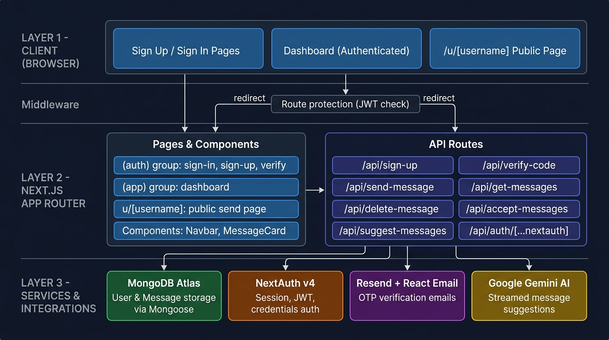
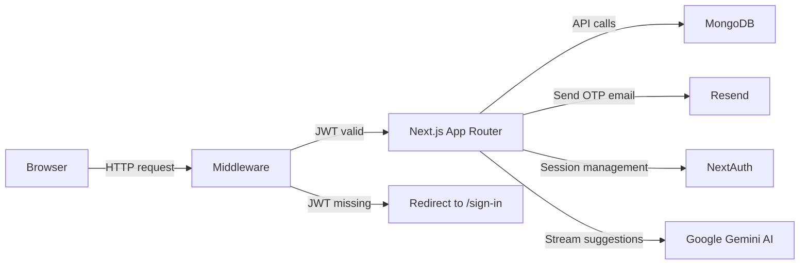
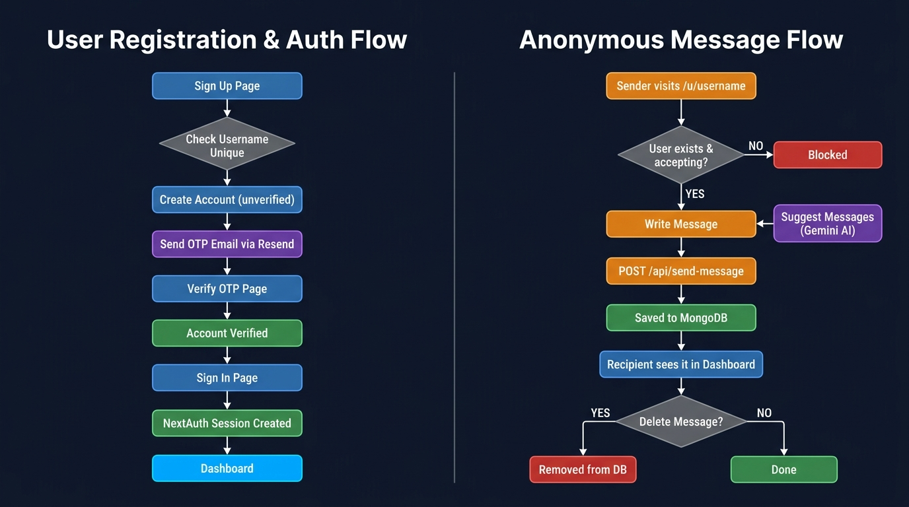

# Mystery Message

An anonymous messaging app where anyone can send you a message through your personal link — no account needed on the sender's side. Built as a learning project to practice full-stack Next.js development.

> Built for learning purposes. Covers auth, database design, email integration, AI streaming, and full-stack Next.js App Router patterns in one project.

---

## Features

- Sign up with username, email, and password
- Email verification via a 6-digit OTP before login is allowed
- Sign in with email or username (NextAuth credentials provider)
- Personal shareable link at `/u/[username]` — no login required to send
- Toggle to stop accepting messages at any time
- AI-powered message suggestions streamed from Google Gemini on the send page
- Static fallback suggestions shown if AI hasn't been triggered yet
- Dashboard showing all received messages, sorted newest first
- One-click copy of your shareable link from the dashboard
- Delete individual messages with a confirmation dialog
- Middleware-level route protection — unauthenticated users can't reach `/dashboard`

---

## Tech Stack

| Technology | Version | Why I Used It |
|---|---|---|
| Next.js (App Router) | 16 | Full-stack in one repo — pages, API routes, middleware all together |
| React | 19 | Latest stable; learning new features like the React Compiler |
| TypeScript | 5 | Catch bugs at build time, better autocomplete |
| Tailwind CSS | 4 | Utility-first styling without writing separate CSS files |
| shadcn/ui | latest | Pre-built accessible components that are easy to customise |
| React Hook Form | 7 | Form state without unnecessary re-renders |
| Zod | 4 | Schema validation shared between client and server |
| NextAuth | 4 | Auth with JWT sessions — credentials provider for email/password |
| MongoDB + Mongoose | 9 | Flexible document model; easy to embed messages inside a user document |
| Resend + React Email | latest | Reliable transactional email with React components as templates |
| Vercel AI SDK | 7 | Streaming AI responses with minimal boilerplate |
| Google Gemini | via AI SDK | Free tier available; good for generating short text suggestions |

---

## Architecture



The app has three layers:

- **Client** — Next.js pages rendered in the browser. Auth pages, the dashboard, and the public send page.
- **Next.js App Router** — Pages and API routes live together. The middleware runs a JWT check on every request before anything else.
- **External services** — MongoDB stores all data. Resend handles email. NextAuth manages sessions. Gemini generates message suggestions.

### How data flows



---

## Workflows

### Sign-up and Email Verification

1. User fills in username, email, and password on `/sign-up`
2. As they type, the username is checked against the database via `GET /api/check-username-unique` (debounced at 300ms)
3. On submit, `POST /api/sign-up` creates the user with `isVerified: false` and generates a 6-digit OTP valid for 1 hour
4. Resend sends the OTP to the user's email using the `VerificationEmail` React Email template
5. User is redirected to `/verify/[username]`
6. On OTP submit, `POST /api/verify-code` checks the code and expiry, then sets `isVerified: true`
7. User is redirected to `/sign-in`

### Sign-in

1. User enters email/username and password on `/sign-in`
2. NextAuth's credentials provider looks up the user by email or username, checks `isVerified`, then compares the password with bcrypt
3. On success, a JWT session is created. The token stores `_id`, `username`, `isVerified`, and `isAcceptingMessages`
4. Middleware redirects authenticated users away from auth pages and unauthenticated users away from `/dashboard`

### Sending an Anonymous Message

1. Anyone visits `/u/[username]` — no login required
2. They type a message and hit "Send It"
3. `POST /api/send-message` looks up the user by username, checks `isAcceptingMessage`, then pushes the message into the user's `messages` array in MongoDB

### AI Message Suggestions

1. On the send page, the user clicks "Suggest Messages"
2. `POST /api/suggest-messages` calls Google Gemini with a prompt asking for 3 open-ended questions separated by `||`
3. The response is streamed back using the Vercel AI SDK's `streamText` and `useCompletion` hook
4. The questions are split by `||` and displayed as clickable buttons — clicking one fills the message textarea

### Dashboard

1. On load, the dashboard calls `GET /api/get-messages` and `GET /api/accept-messages` in parallel
2. Messages are sorted newest-first on the server
3. The accept-messages toggle calls `POST /api/accept-messages` when flipped
4. Clicking the copy button writes `[baseUrl]/u/[username]` to the clipboard
5. Deleting a message shows a confirmation dialog, then calls `DELETE /api/delete-message/[messageid]` which uses MongoDB's `$pull` operator

---

## Project Structure

```
Feedback_App/
├── emails/
│   └── VerificationEmail.tsx     # React Email template for OTP emails
├── public/                       # Static assets
├── src/
│   ├── app/
│   │   ├── (app)/
│   │   │   ├── dashboard/
│   │   │   │   └── page.tsx      # Authenticated dashboard page
│   │   │   └── layout.tsx        # Layout wrapping authenticated pages
│   │   ├── (auth)/
│   │   │   ├── sign-in/          # Sign-in page
│   │   │   ├── sign-up/          # Sign-up page with live username check
│   │   │   └── verify/[username] # OTP verification page
│   │   ├── api/
│   │   │   ├── accept-messages/  # GET and POST — toggle message acceptance
│   │   │   ├── auth/[...nextauth]# NextAuth handler + config (option.ts)
│   │   │   ├── check-username-unique/ # GET — username availability check
│   │   │   ├── delete-message/[messageid]/ # DELETE — remove one message
│   │   │   ├── get-messages/     # GET — fetch all messages for session user
│   │   │   ├── send-message/     # POST — save anonymous message
│   │   │   ├── sign-up/          # POST — register new user
│   │   │   ├── suggest-messages/ # POST — stream AI suggestions from Gemini
│   │   │   └── verify-code/      # POST — validate OTP
│   │   ├── u/[username]/
│   │   │   └── page.tsx          # Public anonymous send page
│   │   ├── layout.tsx            # Root layout with session provider
│   │   └── globals.css           # Global styles
│   ├── components/
│   │   ├── ui/                   # shadcn/ui components
│   │   ├── MessageCard.tsx       # Message display card with delete dialog
│   │   └── Navbar.tsx            # Top nav — shows username and logout/login
│   ├── context/
│   │   └── AuthProvider.tsx      # NextAuth SessionProvider wrapper
│   ├── data/
│   │   └── suggested-messages.json # Static fallback suggestions
│   ├── helpers/
│   │   └── sendVerificationEmail.ts # Calls Resend to send OTP email
│   ├── lib/
│   │   ├── dbConnect.ts          # Mongoose connection with caching
│   │   ├── resend.ts             # Resend client instance
│   │   └── utils.ts              # cn() utility for class merging
│   ├── model/
│   │   └── User.ts               # Mongoose User schema (with embedded messages)
│   ├── schemas/
│   │   ├── acceptMessageSchema.ts
│   │   ├── messageSchema.ts
│   │   ├── signInSchema.ts
│   │   ├── signUpSchema.ts
│   │   └── verifySchema.ts
│   ├── types/
│   │   ├── ApiResponse.ts        # Shared API response type
│   │   └── next-auth.d.ts        # NextAuth session type extensions
│   └── middleware.ts             # JWT check — protects /dashboard, redirects auth pages
├── .env.example                  # Template — copy to .env and fill in values
├── next.config.ts
├── package.json
└── tsconfig.json
```

---

## Getting Started

**Prerequisites**

- Node.js 18 or higher
- A MongoDB database — [MongoDB Atlas](https://www.mongodb.com/atlas) has a free tier
- A [Resend](https://resend.com) account for sending emails
- A [Google AI Studio](https://aistudio.google.com) API key for Gemini

**1. Clone and install**

```bash
git clone <your-repo-url>
cd Feedback_App
npm install
```

**2. Set up environment variables**

```bash
cp .env.example .env
```

Open `.env` and fill in your values (see the table below for where to get each one).

**3. Run the dev server**

```bash
npm run dev
```

Open [http://localhost:3000](http://localhost:3000).

**Available scripts**

```bash
npm run dev      # Start development server
npm run build    # Production build
npm run start    # Start production server (run build first)
npm run lint     # Run ESLint
```

---

## Environment Variables

| Variable | Purpose | Where to Get It | Free? |
|---|---|---|---|
| `MONGODB_URI` | MongoDB connection string | Atlas dashboard → Connect → Drivers | Yes (512 MB free) |
| `RESEND_API_KEY` | Send transactional emails | [resend.com](https://resend.com) → API Keys | Yes (3,000 emails/month) |
| `NEXTAUTH_SECRET` | Sign and verify JWT tokens | Run `openssl rand -base64 32` | — |
| `NEXTAUTH_URL` | Full URL of your deployment | Your domain or `http://localhost:3000` | — |
| `GOOGLE_GENERATIVE_AI_API_KEY` | Gemini AI for message suggestions | [aistudio.google.com](https://aistudio.google.com) → Get API Key | Yes (rate-limited) |

---

## API Routes

| Method | Route | Purpose | Auth Required |
|---|---|---|---|
| `POST` | `/api/sign-up` | Register a new user, send OTP email | No |
| `POST` | `/api/verify-code` | Validate OTP and mark account as verified | No |
| `GET` | `/api/check-username-unique` | Check if a username is already taken | No |
| `POST` | `/api/send-message` | Save an anonymous message to a user | No |
| `POST` | `/api/suggest-messages` | Stream 3 AI-generated question suggestions | No |
| `GET` | `/api/get-messages` | Fetch all messages for the logged-in user | Yes |
| `DELETE` | `/api/delete-message/[messageid]` | Delete one message by ID | Yes |
| `POST` | `/api/accept-messages` | Toggle whether the user accepts messages | Yes |
| `GET` | `/api/accept-messages` | Get the current accept-messages status | Yes |
| `*` | `/api/auth/[...nextauth]` | NextAuth session, sign-in, sign-out | — |

---

## Screenshots

> Add screenshots here after the UI is finalized.

| Page | Screenshot |
|---|---|
| Sign Up | _placeholder_ |
| Sign In | _placeholder_ |
| OTP Verification | _placeholder_ |
| Dashboard | _placeholder_ |
| Public Send Page | _placeholder_ |

---

## Application Workflow



---

## Known Limitations

- **Resend sender domain** — Emails currently send from `onboarding@resend.dev`. To send to any email address (not just your own), you need to verify a custom domain in your Resend account.
- **Gemini rate limits** — The free tier of Google AI Studio has per-minute request limits. If suggestions fail, it's usually this. The app falls back to static suggestions from `suggested-messages.json`.
- **No rate limiting on message sending** — Anyone who knows your username can send unlimited messages to `/api/send-message`. No throttling or CAPTCHA is in place yet.

---

## Future Improvements

- Add rate limiting on `/api/send-message` (e.g. via Upstash Redis)
- Set up a verified sending domain in Resend so emails work for all users
- Add pagination or infinite scroll on the dashboard for users with many messages
- Show message timestamps on the cards
- Add a public profile page that shows a user's accepting status before the sender even types
- Write unit tests for the API routes and Zod schemas
